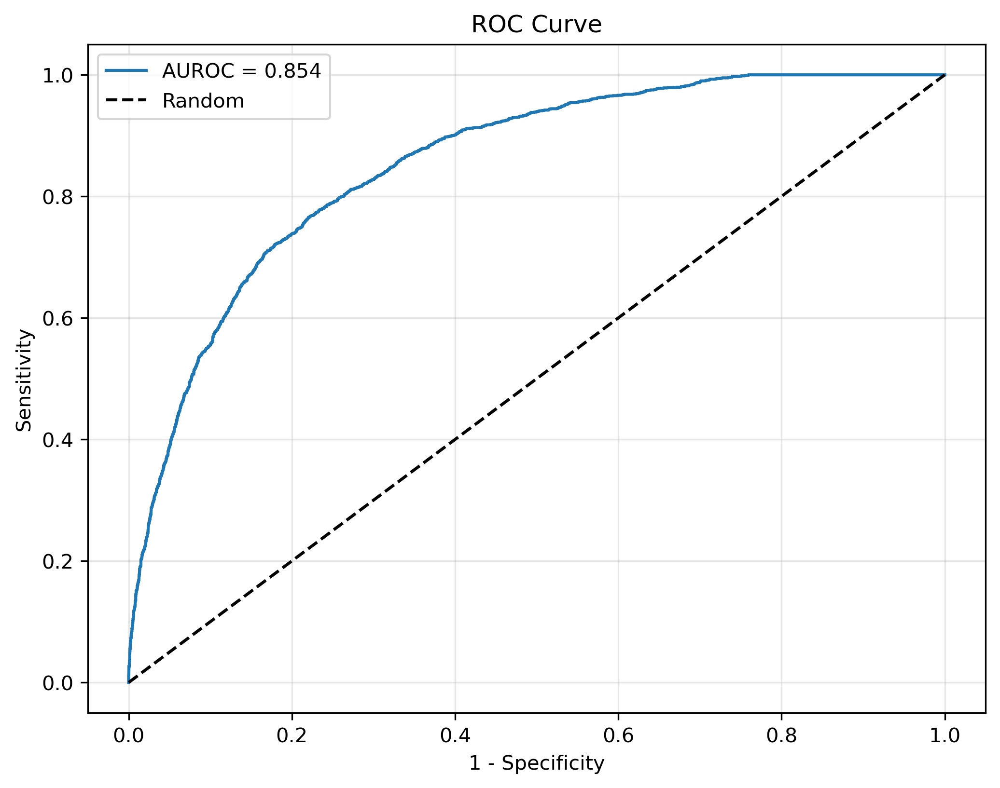
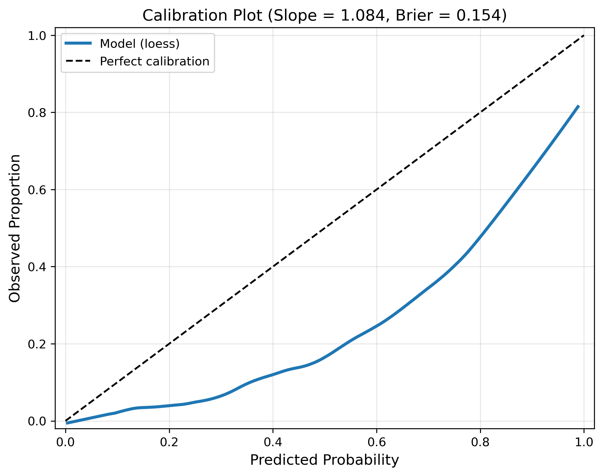
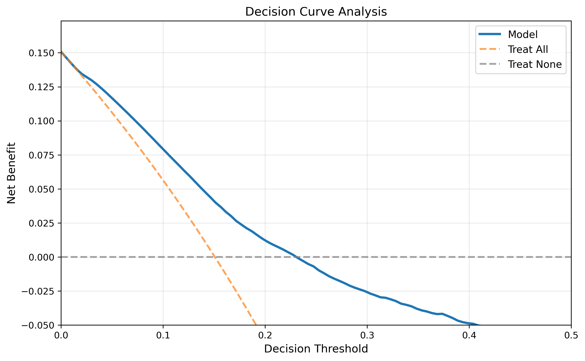

# PHAIR Model Evaluation Suite: Medical Binary Classification 


## Introduction

This repo provides quick, rigorous evaluation of clinical prediction models following the core recommendations from Van Calster et al.'s 2025 *Lancet Digital Health* Viewpoint paper. Given predicted probabilities and true outcomes, it generates the four essential plots/numbers: AUROC, calibration curve, decision curve analysis, and risk distributions.

Performance metric selection for clinical ML models is contentious—researchers disagree on which measures are appropriate. This repo implements recommendations from a comprehensive expert consensus paper, giving you a defensible, citable rationale for your evaluation approach.

## Core Metrics (Van Calster et al. 2025)

1. **AUROC** - Discrimination performance
2. **Calibration Plot** - Agreement between predictions and observations with loess smoothing
3. **Decision Curve** - Net benefit across decision thresholds
4. **Risk Distribution** - Probability distributions by outcome (visualized as violin plots)


## Quickstart

```python
from ldh_eval import evaluate_model
import numpy as np

# Your model predictions
y_true = np.array([0, 1, 1, 0, ...])  # Binary outcomes
y_prob = np.array([0.2, 0.8, 0.6, ...])  # Predicted probabilities

# Generate all recommended plots
evaluate_model(y_true, y_prob, output_dir="results/")
```


## Example Usage

### Set Up Dependencies
```bash
pip install -r requirements.txt
```
or
```bash
conda install --yes --file requirements.txt
```

I recommmend having a single conda environment for this evaluation that you can activate across multiple projects when it's time for reporting.


### Import as Package for Direct Use
```python
from ldh_eval import evaluate_model

# Individual plots
auroc(y_true, y_prob)
calibration(y_true, y_prob)
decision_curve(y_true, y_prob, threshold_range=(0.0, 0.5))
risk_distribution(y_true, y_prob)

# All at once
evaluate_model(y_true, y_prob)
```

### Command Line with Results Directory (Recommended for Cross-Validation)

In your original code that trains or infers from the model, insert the following code snippet to save the true classes and output probabilities in JSON form.

```python
import json

# TRAINING LOOP
for fold_num in range(n_folds):

    ##### ...
    ##### Training logic 
    ##### ...

    # EXAMPLE: FETCH MODEL PROBABILITIES
    probas_ = classifier.predict_proba(X_test)

    # VERIFY OUTPUT DIRECTORY
    results_folder_path = "experiment_results"
    if not os.path.exists(directory_path):
        os.makedirs(directory_path)

    # SAVE TRUE CLASSES AND PROBABILISTIC PREDICTIONS FROM MODEL
    test_predictions = {
        'y_true': y_test.tolist(),
        'y_proba': probas_[:, 1].tolist()
    }
    with open(f"{results_folder_path}/f{fold_num}_predictions.json", 'w') as f:
        json.dump(test_predictions, f, indent=4)
```

After running your training/inference script, the evaluation analysis can be run by passing your output folder (here: `experiment_results`) into `ldh_eval.py`.
 
```bash
python ldh_eval.py --input_dir "experiment_results/"
```
This saves the in-fold plots and numbers in each individual fold's sub-folder, and meta-analysis of all folds into the `input_dir` path.


## Interpreting the Plots

### AUROC (ROC Curve)
The AUROC quantifies discrimination—the model's ability to rank patients correctly. Values closer to 1.0 indicate better discrimination; 0.5 is random guessing.




### Calibration Plot
The calibration plot shows whether predicted probabilities match observed outcomes. The loess curve should hug the diagonal; deviations indicate the model systematically over- or under-predicts risk. A calibration slope near 1.0 is ideal (slope < 1 suggests overfitting, slope > 1 suggests underfitting).



### Decision Curve Analysis
Decision curves show net benefit—whether using the model improves decisions compared to "treat all" or "treat none" strategies. The model is clinically useful only where its curve (blue) is above both reference lines; higher net benefit is better.




### Risk Distribution by Outcome
Violin plots show how predicted probabilities are distributed for patients who did vs. didn't experience the outcome. Good discrimination means clear separation: negatives clustered at low probabilities, positives clustered at high probabilities, with minimal overlap.


## Citation

Van Calster B, Collins GS, Vickers AJ, Wynants L, Kerr KF, Barreñada L, Varoquaux G, Singh K, Moons KGM, Hernandez-Boussard T, Timmerman D, McLernon DJ, van Smeden M, Steyerberg EW, on behalf of Topic Group 6 of the STRATOS initiative. Evaluation of performance measures in predictive artificial intelligence models to support medical decisions: overview and guidance. *Lancet Digit Health* 2025. https://doi.org/10.1016/j.landig.2025.100916