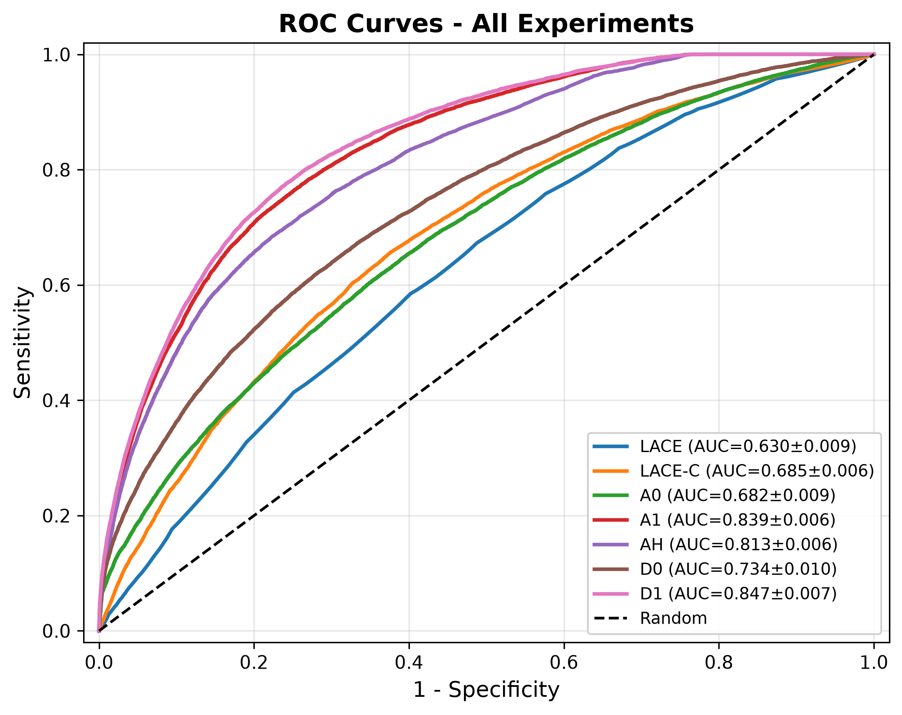
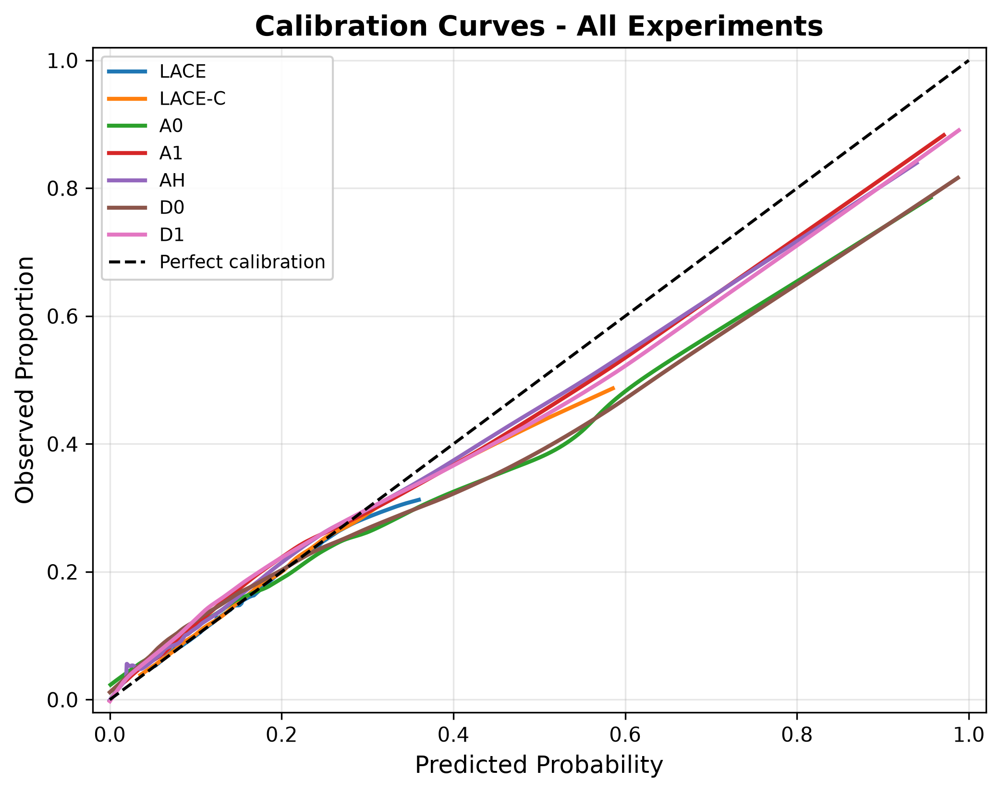
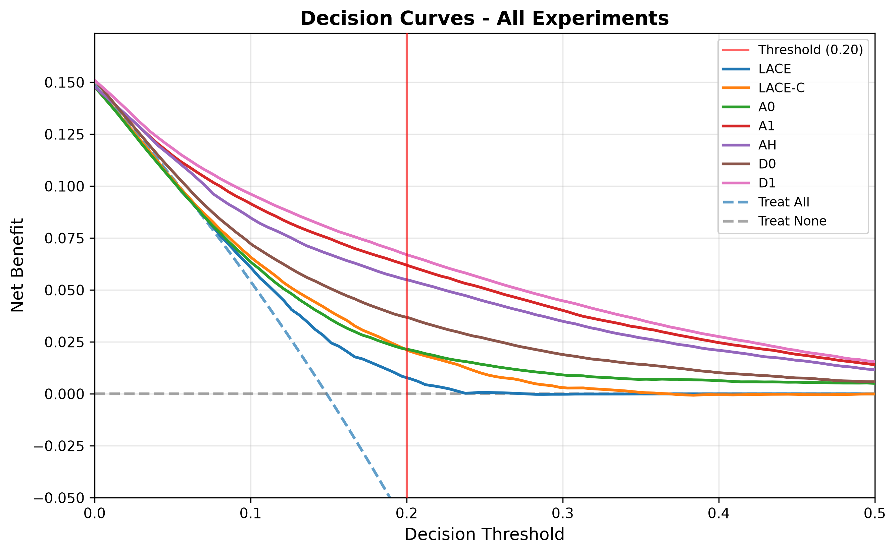
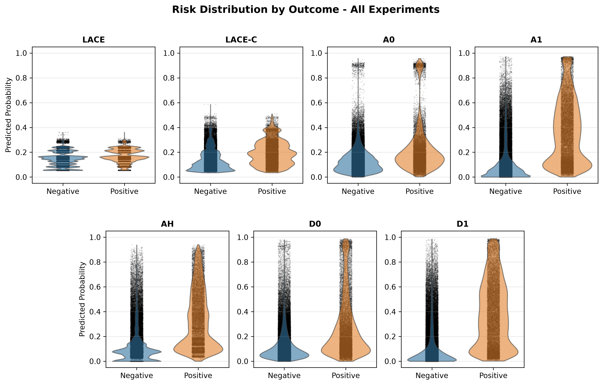

# PHAIR Model Evaluation Suite: Medical Binary Classification 


## Introduction

This repo provides quick, rigorous evaluation of clinical prediction models following the core recommendations from Van Calster et al.'s 2025 *Lancet Digital Health* Viewpoint paper. Given predicted probabilities and true outcomes, it generates the four essential plots/numbers: AUROC, calibration curve, decision curve analysis, and risk distributions.

Performance metric selection for clinical ML models is contentious—researchers disagree on which measures are appropriate. This repo implements recommendations from a comprehensive expert consensus paper, giving you a defensible, citable rationale for your evaluation approach.

## Core Metrics (Van Calster et al. 2025)

1. **AUROC** - Discrimination performance
2. **Calibration Plot** - Agreement between predictions and observations with loess smoothing
3. **Decision Curve** - Net benefit across decision thresholds
4. **Risk Distribution** - Probability distributions by outcome (visualized as violin plots)


## Quickstart

```python
from ldh_eval import evaluate_model
import numpy as np

# Your model predictions
y_true = np.array([0, 1, 1, 0, ...])  # Binary outcomes
y_prob = np.array([0.2, 0.8, 0.6, ...])  # Predicted probabilities

# Generate all recommended plots
evaluate_model(y_true, y_prob, output_dir="results/")
```


## Example Usage

### Set Up Dependencies
```bash
python3 -m venv ldh_eval
source ldh_eval/bin/activate
pip install -r requirements.txt
```
or
```bash
conda create -n lhd_eval
conda activate lhd_eval
conda install --yes --file requirements.txt
```

I recommmend having a single conda environment for this evaluation that you can activate across multiple projects when it's time for reporting.


### Import as Package for Direct Use
```python
from core_eval_functions import *
from ldh_eval import evaluate_model

# Individual plots
auroc(y_true, y_prob)
calibration(y_true, y_prob)
decision_curve(y_true, y_prob, threshold_range=(0.0, 0.5))
risk_distribution(y_true, y_prob)

# All at once
evaluate_model(y_true, y_prob)
```

### Command Line with Results Directory (Recommended for Cross-Validation)

In your original code that trains or infers from the model, insert the following code snippet to save the true classes and output probabilities in JSON form.

```python
import os
import json

# TRAINING LOOP
for fold_num in range(n_folds):

    ##### ...
    ##### Training logic 
    ##### ...

    # EXAMPLE: FETCH MODEL PROBABILITIES
    test_probas_ = classifier.predict_proba(X_test)
    train_probas_ = classifier.predict_proba(X_train)

    # VERIFY OUTPUT DIRECTORY
    results_folder_path = "experiment_results"
    if not os.path.exists(results_folder_path):
        os.makedirs(results_folder_path)

    # SAVE TEST CLASSES AND PROBABILISTIC PREDICTIONS FROM MODEL
    test_predictions = {
        'y_true': y_test.tolist(),
        'y_proba': test_probas_[:, 1].tolist(),

        # OPTIONAL, but required for cluster-bootstrap confidence intervals.
        # Include this whenever one unit (patient, subject, eye, site) can
        # contribute more than one row. See "Clustered data" below.
        'subject_ids': subject_ids_test.tolist(),
    }
    with open(f"{results_folder_path}/fold_{fold_num}_predictions.json", 'w') as f:
        json.dump(test_predictions, f, indent=4)

    # SAVE TRAIN CLASSES AND PROBABILISTIC PREDICTIONS FROM MODEL
    train_predictions = {
        'y_true': y_train.tolist(),
        'y_proba': train_probas_[:, 1].tolist()
    }
    with open(f"{results_folder_path}/train_{fold_num}_predictions.json", 'w') as f:
        json.dump(train_predictions, f, indent=4)

```

#### Recognised keys in the prediction JSONs

| Key | Required | Purpose |
|---|---|---|
| `y_true` | yes | Binary outcomes |
| `y_proba` | yes | Predicted probabilities for the positive class |
| `subject_ids` / `patient_ids` / `cluster_ids` / `group_ids` | no | Per-row cluster label, auto-detected for the cluster bootstrap |
| `record_ids` / `encounter_ids` / `admission_ids` / `ids` | no | Per-row record id, auto-detected when joining cluster labels from a CSV via `--cluster-map` |

Any other keys in the file (`y_pred`, `test_indices`, and so on) are ignored, so it is safe to save extra fields. Names are only auto-detected — you can use any key name you like and point at it explicitly with `--cluster-key` or `--id-key`.

### Arguments and Example Usage

After running your training/inference script, the evaluation analysis can be run by passing your output folder (here: `experiment_results`) into `ldh_eval.py`.
 
```bash
python ldh_eval.py --input_dir "experiment_results/"
```
This saves the in-fold plots and numbers in each individual fold's sub-folder, and meta-analysis of all folds into the `input_dir` path.

Other arguments:

* If the `--recurse` flag is included, the script will assume that the folder `experiment_results/` contains multiple different experiments, each with their own separate folds. The model will do everything as described above for all the experiment subtypes, as well as plot ROC curves, calibration curves, and decision curves across all experiments. By default every subdirectory is included, ordered alphabetically and labelled by directory name.
* If an `--ordering` argument is given (requires `--recurse`), it points at a JSON file that maps experiment directory names to plot labels. This pins the order experiments appear in overlay plots, gives them short legend labels, and restricts the overlays to just the listed experiments. See `example_ordering.json`:
  ```json
  {
      "D1_removedtop0percent": "D1: Remove Top 0%",
      "D1_removedtop5percent": "D1: Remove Top 5%"
  }
  ```
  A list of `[directory_name, plot_label]` pairs is also accepted. Directories named in the file but absent from disk are skipped with a note; if none of them match, the script stops and lists what it expected against what it found.
* If the `--recalibrate` flag is included (RECOMMENDED), logistic recalibration is performed to straighten out the calibration curve. This transformation is monotonic (will not affect discrimination) but tends to improve calibration-related metrics with few if any drawbacks. This is the only option that requires the `train_*_predictions.json` files — without it, only the `fold_*_predictions.json` files are read. 
* If a `--threshold` argument is given (between 0 and 1), an additional suite of evaluations will be saved alongside each analysis: 
  * `alert_rate`: the percentage of positive predictions when evaluated at the given threshold
  * `sensitivity`
  * `specificity`
  * `ppv`: Positive Predictive Value
  * `npv`: Negative Predictive Value
  * `tp`: True Positives
  * `tn`: True Negatives
  * `fp`: False Positives
  * `fn`: False Negatives
* If the `--bengio-correction` flag is included (requires `--recurse`), pairwise statistical comparisons between all experiments are run using the Nadeau-Bengio corrected paired t-test. This test accounts for the fact that cross-validation folds share training data, making a naive paired t-test anti-conservative. Each comparison also reports a corrected **confidence interval on the difference**. Two output files are saved to `overlay_results/`:
  * `bengio_correction.csv` — long-form table with corrected t-statistics, two-tailed p-values, confidence intervals, and mean metric differences for every pairwise experiment comparison and every performance metric
  * `bengio_correction_auroc_pvals.csv` — square p-value matrix for AUROC, convenient for copy-paste into tables
* If a `--bootstrap N` argument is given, bootstrap confidence intervals are computed from `N` resamples of the pooled out-of-fold predictions. Default is `0` (off), so runtime is unchanged unless you ask for it. `2000` is a reasonable choice for reporting. **If one unit can contribute more than one row to your data, also read [Clustered data](#clustered-data-important) below** — otherwise the intervals will be too narrow.
* `--cluster-key KEY` names the key in your prediction JSONs holding a per-row cluster label. Only needed if auto-detection doesn't find it.
* `--cluster-map FILE.csv` supplies cluster labels from an external CSV instead, joined on a per-row record id. `--id-key KEY` names the record id array in the JSON, and `--cluster-map-cols ID,CLUSTER` names the two CSV columns (defaults to the file's first two columns, in that order).
* `--ci-level L` sets the confidence level for both the bootstrap and the Nadeau-Bengio intervals (default `0.95`).
* `--seed S` seeds the bootstrap resampling so intervals are reproducible (default `0`).
* `--skip-failed` (requires `--recurse`) downgrades a failed experiment from an error to a warning. See [When an experiment fails](#when-an-experiment-fails) — you almost certainly do not want this for figures you intend to publish.

Putting it together — the full analysis, with cluster-aware confidence intervals:

```bash
python ldh_eval.py --input_dir "experiment_results/" --recurse --recalibrate --threshold "0.2" --bengio-correction --ordering example_ordering.json --bootstrap 2000
```

If your prediction JSONs don't already carry a cluster label, add `--id-key`/`--cluster-map` as described under [Clustered data](#clustered-data-important).

### When an experiment fails

With `--recurse`, if any experiment fails to evaluate the run **stops with an error** and no overlay plots or comparison tables are written. This is deliberate. The alternative — carrying on and emitting a figure that quietly omits a model — is the worst possible outcome, because the output looks complete and publishable.

The error names every failure with its cause, and lists what did succeed:

```
RuntimeError: 2 of 7 experiment(s) failed to evaluate:
  - LACE: KeyError: ".../LACE/1/fold_1_predictions.json: --id-key 'hadm_ids' not
    present. Available keys: ['test_indices', 'y_pred', 'y_proba', 'y_true']"
  - LACE-C: KeyError: ...

Succeeded: ['A0', 'A1', 'AH', 'D0', 'D1']

Stopping rather than writing overlay plots and comparison tables that silently omit
the failed experiment(s) ...
```

Common causes: a missing `train_*_predictions.json` under `--recalibrate`, a cluster key present in some experiments but not others, or a record id absent from `--cluster-map`.

Three cases are treated differently, on purpose:

| Situation | Behaviour |
|---|---|
| Experiment exists but fails to evaluate | **Error** — the run stops |
| Auto-discovered subdirectory containing no `fold_*_predictions.json` | Skipped with a note — it isn't an experiment (e.g. a `notes/` folder) |
| Directory named in `--ordering` that doesn't exist on disk | Skipped with a note — lets one ordering file be reused across subsets |

Note the last row: a *missing* directory is a note, whereas a directory that exists and *breaks* is an error. That way a shared ordering file can list every experiment you have ever run, while a real failure in a run you actually asked for still stops you.

`--skip-failed` reverses the first case, continuing with whatever succeeded and printing a prominent warning naming what was excluded. Reserve it for exploratory runs.

### A note on the Bengio-Nadeau correction

A standard paired t-test over fold-level differences underestimates variance because any two folds share the majority of their training data, making their scores positively correlated. Nadeau & Bengio (1999) derived a corrected variance estimate:

```
corrected_var = (1/k + n_test/n_train) × var(differences)
```

where `k` is the number of folds, `n_test` is the average test set size per fold, and `n_train` is the average training set size per fold. The t-statistic is then `mean(differences) / sqrt(corrected_var)`, evaluated against a t-distribution with `k - 1` degrees of freedom. The correction is conservative relative to the naive test, and is stronger when `n_test/n_train` is large — that is, when you use few folds.

`n_train` is read from your `train_*_predictions.json` files when they are present, and the `n_train_source` column in `bengio_correction.csv` records `measured` when this happened. If they are absent it falls back to the standard k-fold identity `n_train ≈ (k-1) × n_test` and reports `assumed`. Note that under that fallback the correction factor reduces to `1/k + 1/(k-1)`, which depends only on the fold count — dataset size cancels out entirely. Saving the training predictions is therefore worthwhile even if you never use `--recalibrate`.

---

## Confidence Intervals

Two mechanisms are available, and they answer **different questions**. Reporting the right one — or both — matters more than the choice of software.

| | Bootstrap CI | Nadeau-Bengio CI |
|---|---|---|
| Flag | `--bootstrap N` | `--bengio-correction` |
| Applies to | One model's performance | The *difference* between two models |
| Source of uncertainty | Which subjects you happened to sample | Which training split you happened to get |
| Unit of analysis | Subject (or cluster) | Fold |
| Where it lands | `bootstrap_ci.json`, `combined_metrics*` | `bengio_correction.csv` |
| Typical paper use | Per-model results table | Model-comparison claims |

A bootstrap interval will usually be **narrow** on a large dataset, because it reflects patient-sampling noise only and says nothing about how much the model would change if retrained on a different split. The Nadeau-Bengio interval captures the latter but is based on only `k` fold scores, so it has few degrees of freedom. They are complements, not competitors. If they disagree wildly, something is wrong — that is a useful cross-check.

### Bootstrap CIs on model performance

```bash
python ldh_eval.py --input_dir "experiment_results/" --bootstrap 2000
```

This resamples the pooled out-of-fold predictions with replacement `N` times, recomputing every rate-valued metric on each resample, and reports the percentile interval. Metrics covered: `prevalence_pct`, `auroc`, `calibration_slope`, `brier_score`, and — when `--threshold` is given — `alert_rate`, `sensitivity`, `specificity`, `ppv`, `npv`.

Raw counts (`n`, `tp`, `tn`, `fp`, `fn`) are deliberately **excluded**: a count computed on a resample is not comparable to the count on the original data.

Note that no models are retrained. The bootstrap operates entirely on the probabilities you already saved, which is why it costs seconds rather than days. (The `.632+` and Harrell optimism-correction bootstraps *do* refit per resample — that is a different procedure, and not what this implements.)

### Clustered data (IMPORTANT)

If **one unit can contribute more than one row** to your dataset, rows are not independent and the default row-level bootstrap will produce intervals that are **too narrow**. This is extremely common in medical data:

* a patient with several hospital encounters
* a subject imaged at several timepoints
* an eye, joint, or lesion measured repeatedly
* a recruiting site contributing many cases

The fix is the **cluster bootstrap**: resample *units* with replacement, taking all of a unit's rows together. Supply a per-row cluster label and this happens automatically.

**How much does it matter?** Variance inflation tracks the *effective* cluster size, `Σm²/Σm`, not the mean — a long tail of large clusters matters far more than the average. On a real 121k-row cohort with 65k units, mean 1.86 rows per unit but a heavy tail, the naive interval was too narrow by **1.43× for AUROC and 1.80× for PPV**. Rank-based measures like AUROC are somewhat buffered; metrics that are row means (PPV, alert rate, prevalence) are hit hardest.

The tool reports the diagnostics so you can see this for yourself:

```
4,000 clusters | mean size 2.23 | effective size 2.75 | max 8
```

There are two ways to supply the labels.

**Route 1 — the label is already in the prediction JSON.** Preferred. Auto-detected if the key is named `subject_ids`, `patient_ids`, `cluster_ids`, or `group_ids`:

```bash
python ldh_eval.py --input_dir "experiment_results/" --bootstrap 2000
```

Name it explicitly if you use some other key:

```bash
python ldh_eval.py --input_dir "experiment_results/" --bootstrap 2000 --cluster-key eye_id
```

**Route 2 — join the label from a CSV.** Use this when your saved predictions carry a *record*-level id (an encounter, admission, or image id) but the cluster is a level above it, and you don't want to re-run inference just to add a column. Supply a two-column lookup:

```csv
record_id,subject_id
10001234,7001
10001235,7001
10002000,7002
```

```bash
python ldh_eval.py --input_dir "experiment_results/" --bootstrap 2000 \
    --id-key record_ids \
    --cluster-map lookup.csv \
    --cluster-map-cols record_id,subject_id
```

`--cluster-map-cols` defaults to the first two columns of the file in `(record, cluster)` order, so name them explicitly if your CSV happens to list them the other way round. Numeric ids are normalised, so `12345`, `"12345"`, and `12345.0` all match.

Every row must resolve to a cluster. If any record id is missing from the map the run **stops with an error** rather than silently mixing clustered and unclustered rows.

**If no cluster label is found**, the tool falls back to row-level resampling and prints a warning. That fallback is correct only when each unit contributes exactly one row.

### Nadeau-Bengio CIs on model differences

Included automatically with `--bengio-correction`. The interval is built from the *same* corrected variance estimate as the p-value, so it excludes zero exactly when `p < 1 - ci_level`. Console output looks like:

```
Pairwise AUROC comparisons (Bengio-Nadeau corrected, two-tailed, 95% CI):
  * A0 vs A1: Δ=+0.0932 (+0.0463 to +0.1401), p=0.00528
```

Reportable as: *"AUROC difference +0.093 (95% CI 0.046 to 0.140)"*. For every metric, `bengio_correction.csv` carries `{metric}_ci_lo`, `{metric}_ci_hi`, and a ready-to-paste `{metric}_formatted` column.

Clustering does **not** affect this interval, provided each cluster stays within a single fold (as it must, to avoid leakage) — the fold is the unit of analysis, not the row.

### Two caveats worth stating in a methods section

1. **No multiple-comparison correction is applied.** Comparing 7 experiments means 21 pairwise tests per metric. If you report `sig_p05` across many pairs, apply Holm or Benjamini-Hochberg yourself, or say plainly that the p-values are uncorrected.
2. **The bootstrap CI does not include model-training variability**, and the Nadeau-Bengio CI does not include patient-sampling variability. Neither is a complete uncertainty estimate on its own.

### Runtime

Roughly 25 ms per resample at 120k rows for all metrics combined, single-threaded:

| Rows | `--bootstrap 2000`, per experiment |
|---|---|
| 10k | ~5 s |
| 120k | ~50 s |
| 120k × 7 experiments | ~6 min |

The calibration slope is the most expensive component (it fits a logistic regression per resample). Halve `N` to halve the time; `N=1000` is usually enough for a stable 95% interval, while `N=2000+` steadies the tails.

### Output files

| File | Location | Contents |
|---|---|---|
| `metrics.json` | each fold dir | Per-fold metrics, including `n_train` when available |
| `aggregate_metrics.json` | experiment dir | Fold mean ± SD per metric |
| `bootstrap_ci.json` | experiment dir | Point estimate, CI bounds, bootstrap SD, and cluster diagnostics |
| `combined_metrics.csv` | `overlay_results/` | Numeric table: `_mean`, `_std`, plus `_pooled`, `_ci_lo`, `_ci_hi` |
| `combined_metrics_formatted.tsv` | `overlay_results/` | Paste-ready: `mean (±SD)` columns plus `{metric}_ci` columns |
| `bengio_correction.csv` | `overlay_results/` | Pairwise differences, CIs, t-statistics, p-values |
| `bengio_correction_auroc_pvals.csv` | `overlay_results/` | Square AUROC p-value matrix |

The `_mean`/`_std` columns are never removed or overwritten, so existing tables built on them keep working. Bear in mind that `{metric}_mean` (average of the per-fold values) and `{metric}_pooled` (computed once on all out-of-fold predictions) are different estimands and will differ slightly; the CI belongs to the pooled figure.

p-values are written at full float precision rather than rounded, so genuinely tiny values appear as e.g. `4.99e-06` instead of collapsing to `0.0`.


## Interpreting the Plots

### AUROC (ROC Curve)
The AUROC quantifies discrimination—the model's ability to rank patients correctly. Values closer to 1.0 indicate better discrimination; 0.5 is random guessing.




### Calibration Plot
The calibration plot shows whether predicted probabilities match observed outcomes. The loess curve should hug the diagonal; deviations indicate the model systematically over- or under-predicts risk. A calibration slope near 1.0 is ideal (slope < 1 suggests overfitting, slope > 1 suggests underfitting). Poor calibration can often be solved by using the `--recalibrate` argument.



### Decision Curve Analysis
Decision curves show net benefit—whether using the model improves decisions compared to "treat all" or "treat none" strategies. The model is clinically useful only where its curve (blue) is above both reference lines; higher net benefit is better.




### Risk Distribution by Outcome
Violin plots show how predicted probabilities are distributed for patients who did vs. didn't experience the outcome. Good discrimination means clear separation: negatives clustered at low probabilities, positives clustered at high probabilities, with minimal overlap.




## Citation for Original Paper

Van Calster B, Collins GS, Vickers AJ, Wynants L, Kerr KF, Barreñada L, Varoquaux G, Singh K, Moons KGM, Hernandez-Boussard T, Timmerman D, McLernon DJ, van Smeden M, Steyerberg EW, on behalf of Topic Group 6 of the STRATOS initiative. Evaluation of performance measures in predictive artificial intelligence models to support medical decisions: overview and guidance. *Lancet Digit Health* 2025. https://doi.org/10.1016/j.landig.2025.100916